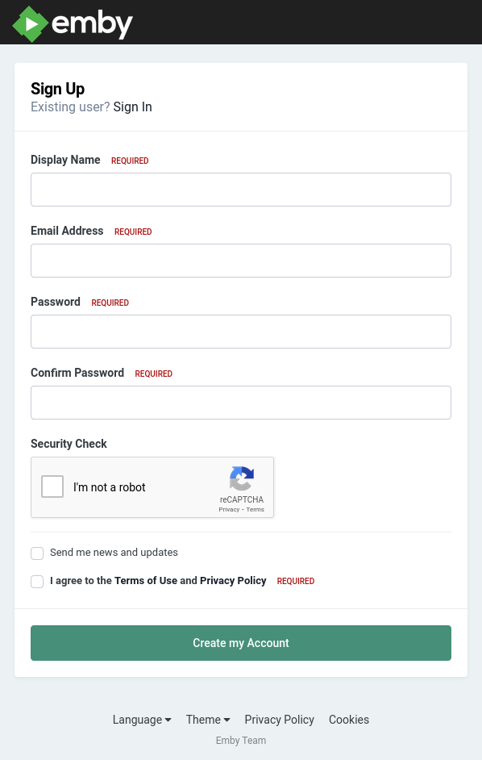

# Emby Connect

## Create Emby Connect Account

You'll want to start by creating an Emby Connect account first.  This account will make it easier for your to login on your various devices.

To sign up visit the following url and click the Sign Up button at the bottom of the page. [https://emby.media/pin.html](https://emby.media/pin.html){target="_blank"}

{width="300"}

Once you click on Sign Up you'll be presented with the following form.

{width="300"}

You will need this account anytime you want to login to Emby.  Please save this in your password manager or however you save your passwords.  We **CAN NOT** help you with this account if you forget it.  You'll have to do a password reset or create a new account if that doesn't work.

- **Display Name** This is essentially your username.  Use whatever you'd like but I'd avoid using spaces.
- **Email Address** Your email
- **Password** A secure password
- **Confirm Password** Reenter the same password
- **Send me news and updates** _Unchecked_ Unless you want to be on their newsletter.  
-- **Terms and Conditions** _Checked_

## Sign In On Your Devices

The quickest way to get logged in on any of your devices is to use Emby Connect.  Emby Connect will allow you to login using the same method you use to login to your Netflix, Hulu or Disney+ accounts.  You'll be presented with a pin number on the device you're attempting to login to.  You'll then use your phone or computer to visit the URL on the screen where you'll login with your Emby Connect account and enter the pin to authorize the device.

To authorize a device using the pin on your screen visit the following URL: [https://emby.media/pin.html](https://emby.media/pin.html){target="_blank"}

{width="300"}

Enter your Emby Connect username and password and the pin number you see on the screen and click Submit.  Give the device a few seconds to receive the registration info and then you're screen will refresh and show you your available servers.  

Select Rogue One and enjoy!