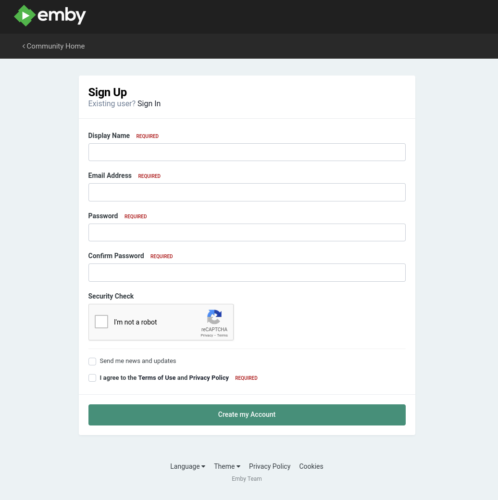

# Getting Started With Emby

## Emby Connect Registration

The quickest way to get logged in on any of your devices is to use Emby Connect.  Emby Connect is the same method you use to login to your Netflix, Hulu or Disney+ accounts.

You'll need to create an Emby Connect account by going to the following page and clicking on Sign Up: [https://emby.media/pin.html](https://emby.media/pin.html){target="_blank"}

On the sign up page fill in the form with your information.  We recommend that your display name not contain spaces.  This is basically your username.  Be sure to save these details somewhere because you'll need them everytime you want to login to a new device.

{width="300"}

## Logging Into Emby From Client Devices

How to login on Apple TV, Shield TV, Roku, FireTV, etc.

## Emby Client Settings

When you edit the settings on a client it changes those settings on that client only.  You might notice more or less settings depending on the client you're using.

### Display

These settings adjust how Emby looks on each client.  Most of them are documented on screen and you can adjust any you see fit.  

### Home Screen

This allows you to adjust what sections appear on your Emby home screen as well as the order the librarys are displayed.  

### Playback

#### Audio

- **Preferred Audio Language**  Set this to _English_
- **Play default audio track regardless of language** _Unchecked_
- **Remember audio track selections** _Checked_
- **Internet quality** Set to _Auto_

#### Video

- **Home network quality** Set to _Auto_
- **Internet quality** [Determine Your Internet Quality](../reference/internet-quality.md)
- **Chromecast streaming quality** Set to _Auto_

#### Advanced

- **Enable cinema intros** _Checked_ (This is not currently enabled on the server)
- **Play next episode automatically** Your Preference
- **Enable next video info during playback** Your Preference
- **Video player back button behavior** _Stop_ or your preference
- **Skip forward length** Default _10 seconds_ or your preference
- **Skip back length** Default _10 seconds_ or your preference
- **When resuming, automatically rewind** Default _0 seconds_ or your preference
- **Intro Skipping** _Show 'Skip Intro' button_ (This is currently in testing and hoping to deploy soon.)
- **Enable 'Are you still watching?' prompt** _Checked_
- **Display rating information on video playback start** _Checked_ or your preference

### Subtitles

- **Preferred subtitle language** Set this to _English_
- **Subtitle mode** Set this to _Only forced subtitles_
- **Remember subtitle track selections** _Checked_

#### Subtitle Appearance

These settings are complete user preference.  You can adjust them and see the example change as you make edits.  
